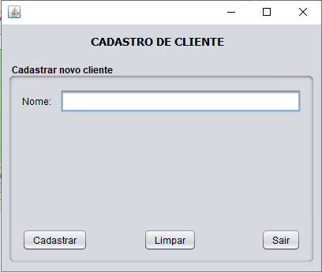
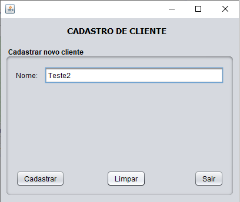
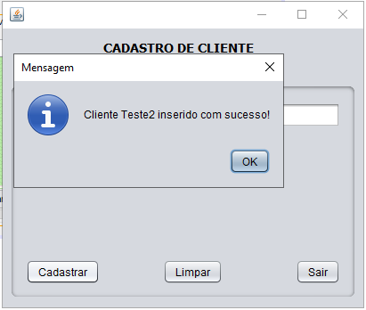
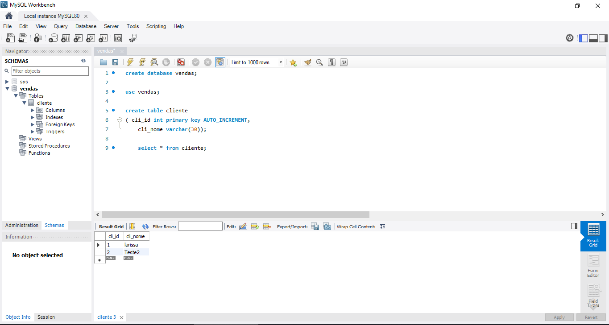

<h1 align="center">Projeto CRUD (Java) </h1>

 

  <a href="#ap">Apresentação</a>&nbsp;&nbsp;&nbsp;|&nbsp;&nbsp;&nbsp;
  <a href="#desenvolvimento">Desenvolvimento</a>&nbsp;&nbsp;&nbsp;|&nbsp;&nbsp;&nbsp;
  <a href="#resultado">Resultado</a>&nbsp;&nbsp;&nbsp;|&nbsp;&nbsp;&nbsp;
  <a href="#dev">Dev</a>

## 🖱 Apresentação

Dentro do desenvolvimento de sistemas, CRUD é empregado como um acrônimo para Create (criar), Read (ler/exibir), Update (atualizar) e Delete (apagar). Essas são consideradas as funções básicas de um sistema que trabalha com banco de dados. 
 Para ilustrar esse processo, foi usado como exemplo um sistema de cadastro de clientes. Inicialmente esse sistema só requer o nome do cliente, mas podem ser inseridas outras informações, a depender do objetivo do desenvolvimento.

  
  ## 📈 Desenvolvimento
  

O primeiro passo foi criar o banco de dados "Vendas" e a tabela "Cliente" no MySQL. 
 Em seguida, na IDE Netbeans, foi criado o Projeto "Proj_Venda" e, dentro dele, os pacotes dao, factory, modelo e gui:
  
* No pacote DAO, foi inserida a classe ClienteoDAO, onde foram configurados os dados de persistência, que ficarão registrados no banco de dados;
  
* Dentro do pacote Factory, foi criada uma classe principal responsável por fazer a interface com o driver JDBC (permite a conexão com qualquer banco);
  
* Já no pacote modelo, foi desenvolvida a classe Cliente, contendo os atributos e os métodos get e set, usados para guardar e alterar os valores inseridos pelo usuário do software ao cadastrar uma nova pessoa;
  
* Por fim, no pacote GUI, foi criada uma classe principal denominada ClienteGUI, voltada à interação com o usuário. Esta é a classe que contém as configurações do Graphical User Interface ou Interface Gráfica de Usuário.
  
  

→ [Voltar ao topo](#topo)

  
  ## 🖥 Resultado
  

Ao executar a aplicação, a seguinte janela é aberta:
  

  
   
   
  

Nesta janela, o usuário tem a opção de limpar o conteúdo inserido, de sair da aplicação ou de cadastrar um novo cliente inserindo o respectivo nome:
  

  
   
   
  

  

Inserido o nome desejado, basta que o usuário clique no botão "Cadastrar" para que a aplicação confirme a realização do cadastro:
  

  
   
   
  

  

Realizado o cadastro, o nome é automaticamente adicionado ao banco de dados:
  

  
   
   
  

→ [Voltar ao topo](#topo)

  
> Larissa Diniz, 2022 :star2:  
> ❤️ [Github](https://github.com/laaridiniz) 
> 💙 [LinkedIn](https://www.linkedin.com/in/larissa-diniz-dev/) 

